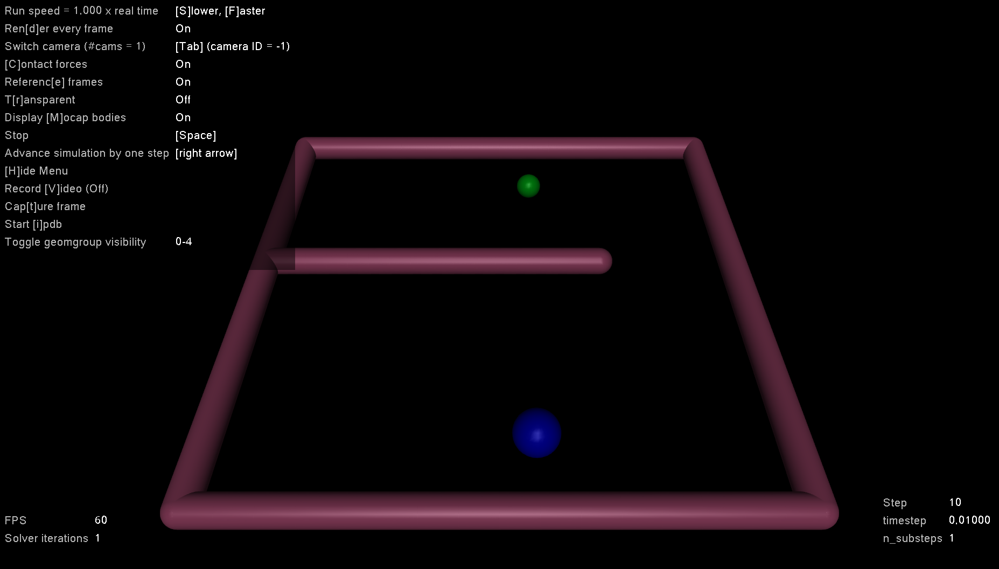
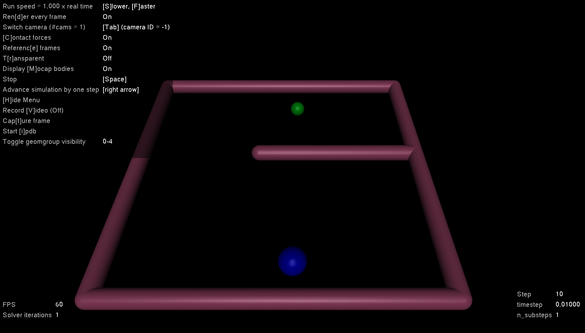
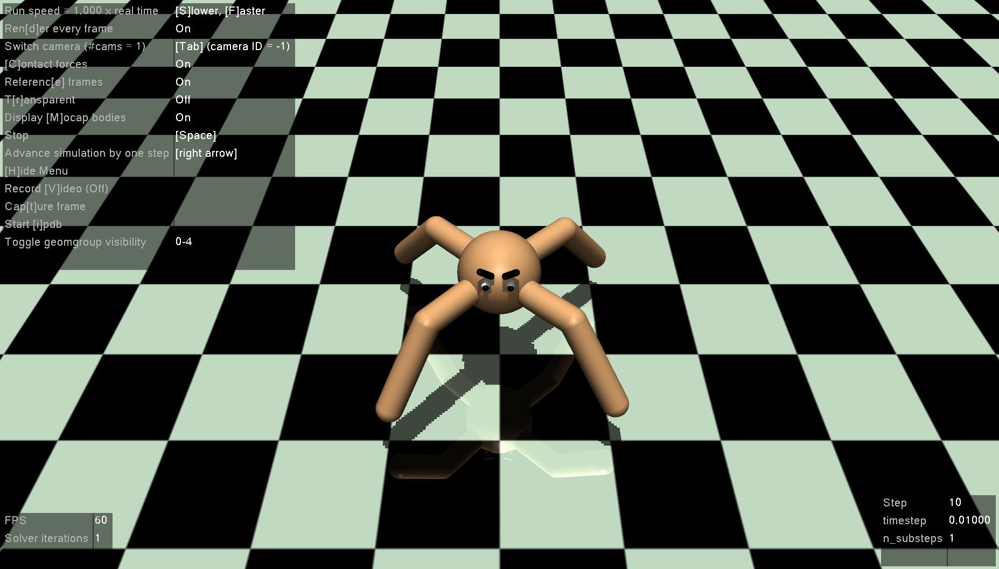
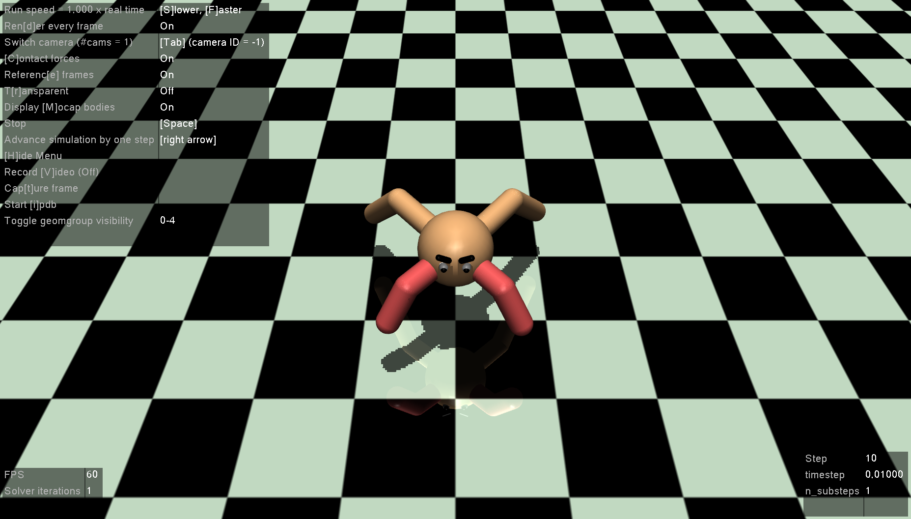

# Gym Environments for Inverse RL

Implementations of Gym Interface Environments used for Inverse Reinforcement Learning Paper

## Setup
```bash
git clone https://github.com/uidilr/irl_gym.git
cd irl_gym
pip install -e .
```

## Usage

Environments are already registered to gym if it is correctly set up.

```
import gym

env = gym.make("irl_gym:PointMazeLeft-v0")
```

## Environments

PointMazeLeft-v0




PointMazeRight-v0


CustomAnt-v0


DisabledAnt-v0


This repository registers environments below
```
register(id='TwoDMaze-v0',
         entry_point='irl_gym.envs.twod_maze:TwoDMaze')
register(id='PointMazeLeft-v0', entry_point='irl_gym.envs.point_maze:PointMazeEnv',
         kwargs={'sparse_reward': False, 'direction': 0})
register(id='PointMazeRight-v0', entry_point='irl_gym.envs.point_maze:PointMazeEnv',
         kwargs={'sparse_reward': False, 'direction': 1})

register(id='CustomAnt-v0', entry_point='irl_gym.envs.ant_env:CustomAntEnv',
         kwargs={'gear': 30, 'disabled': False})
register(id='DisabledAnt-v0', entry_point='irl_gym.envs.ant_env:CustomAntEnv',
         kwargs={'gear': 30, 'disabled': True})

register(id='VisualPointMazeRight-v0', entry_point='irl_gym.envs.visual_pointmass:VisualPointMazeEnv',
         kwargs={'sparse_reward': False, 'direction': 1})
register(id='VisualPointMazeLeft-v0', entry_point='irl_gym.envs.visual_pointmass:VisualPointMazeEnv',
         kwargs={'sparse_reward': False, 'direction': 1})

```

## License
MIT
